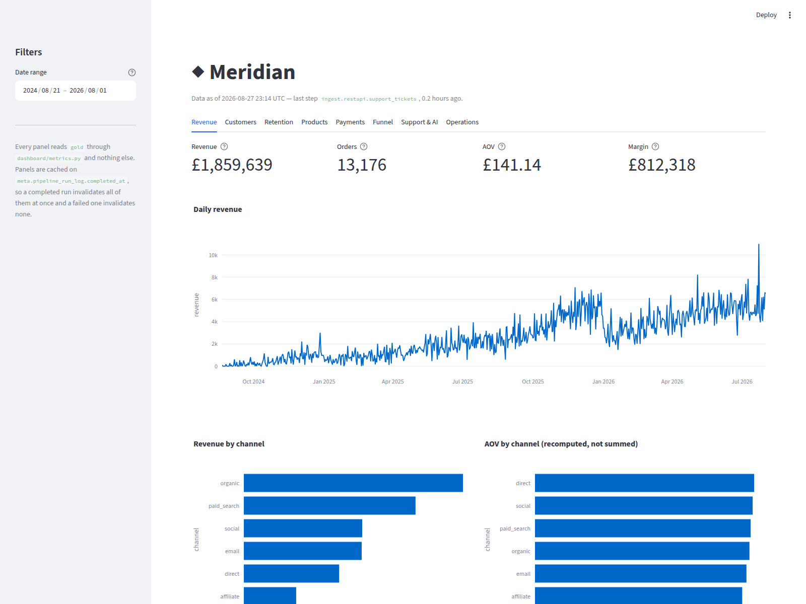

# Meridian

An end-to-end analytics platform for a mid-size online retailer — batch and
streaming ingestion, a Parquet lakehouse, a dimensional warehouse, orchestration,
data quality, governance, and a retrieval-augmented AI layer over customer
support history.

> **Build status: Phase 3 of 8 complete.** This README describes the system being
> built. Sections marked *planned* are not implemented yet. See
> [`docs/PROGRESS.md`](docs/PROGRESS.md) for exactly what exists today — it is
> updated at the end of every work session and is the resume point.

---

## The business problem

A retailer running on a transactional database can answer "what is this order's
status" instantly and "why did margin fall in the Northeast last quarter" not at
all. The operational system is built for row-at-a-time writes; the questions the
business actually asks are aggregations across millions of rows and several
sources that disagree with each other.

Meridian is the layer that closes that gap. It takes orders, payments, web
behaviour, product data and support conversations from five different source
systems, reconciles them, and serves them as a warehouse the business can query
without knowing where anything came from.

Concretely, it answers:

- **Revenue and trend** — what did we sell, through which channel, at what margin
- **Customer value** — who is valuable, who is at risk, how do cohorts retain
- **Payment health** — what share of authorisations fail, and why
- **Funnel** — where visitors drop out between view and purchase
- **Support load** — what customers complain about, at what volume and sentiment

The last one is where the AI layer earns its place. Support tickets are free
text; they are the richest signal in the business and the least queryable. The
platform embeds them, classifies intent and sentiment with an LLM, and writes
those classifications **back into the warehouse** as dimensions the dashboard
joins against — so "which product category generates the most angry tickets"
becomes a SQL question.

---

## Architecture

```
   ┌────────────┐  ┌───────────┐  ┌────────────┐  ┌───────────┐  ┌──────────┐
   │ OLTP       │  │ CSV/JSON  │  │ Own REST   │  │ Vendor    │  │ Redpanda │
   │ Postgres   │  │ file drop │  │ API        │  │ API       │  │ stream   │
   └─────┬──────┘  └─────┬─────┘  └─────┬──────┘  └─────┬─────┘  └────┬─────┘
         └───────────────┴──────────────┴───────────────┴─────────────┘
                                     │
                        full + incremental ingestion
                                     ▼
                    ┌────────────────────────────────┐
                    │ BRONZE — raw Parquet on MinIO  │
                    │ append-only, frozen metadata   │
                    └───────────────┬────────────────┘
                                    │  DuckDB over httpfs
                                    ▼
                    ┌────────────────────────────────┐
                    │ SILVER — typed, deduped, PII   │
                    │ scrubbed; bad rows quarantined │
                    └───────────────┬────────────────┘
                                    │  DuckDB → Arrow → COPY
                                    ▼
                    ┌────────────────────────────────┐
                    │ GOLD — dbt star schema         │
                    │ 3 dims · 5 facts · 7 marts     │
                    └───────────────┬────────────────┘
                          ┌─────────┴─────────┐
                          ▼                   ▼
                  ┌───────────────┐   ┌───────────────┐
                  │ Streamlit BI  │   │ RAG / Ask the │
                  │ dashboard     │   │ Data          │
                  └───────────────┘   └───────────────┘

        Airflow orchestrates every hop. Data quality gates each one.
```

The one architectural decision worth calling out: **DuckDB is the lake engine,
Postgres is the warehouse.** `dbt-postgres` cannot read Parquet from object
storage, so a design with "Parquet lake + dbt + Postgres" has a hole in the
middle where Bronze and Silver never reach dbt at all. DuckDB queries Parquet in
place over `httpfs`, and the Silver→warehouse hop streams through Arrow into
`COPY`. dbt never touches object storage; DuckDB never writes to Gold.

Full reasoning, and every other cross-component decision, is in
[`docs/CONTRACTS.md`](docs/CONTRACTS.md).

---

## Quickstart

```bash
cp .env.example .env      # then set the passwords; nothing has a default
make venv                 # .venv with the rag and dev extras
make seed                 # generate all source data (deterministic, ~15s)
make up                   # Postgres (pgvector) + MinIO, waits for health
make pipeline             # source system -> Bronze -> Silver -> warehouse -> DQ
make rag-index            # chunk, mask, embed, upsert  (~3 min first run)
make dbt-venv             # a second interpreter, for dbt only (see below)
make gold                 # enrich -> snapshot backfill -> dbt run -> test -> record
make stream-up            # Redpanda + the topics declared in contracts/topics.yml
make stream-demo          # produce, consume with both groups, show lag and the DLQ
make api                  # the REST API on :8000 — /docs is the OpenAPI browser
make api-demo             # exercise every endpoint over the network
make dashboard            # the Streamlit dashboard on :8501
make rag-eval             # measure recall@5 against the golden set
make test                 # the full suite
```

`make pipeline` is five steps you can also run one at a time — `bootstrap`,
`load-oltp`, `ingest`, `silver`, `load-warehouse`. `make ingest-incremental` is
what the second and every later run does: it reads watermarks from
`meta.ingest_watermarks` and captures only what changed.

Then ask it something:

```bash
make search Q="tracking has not updated in over a week"
make ask    Q="why do customers ask for refunds?"
```

dbt gets **its own virtualenv**, separate from `.venv`, and that is not tidiness.
Airflow 3.1.3's constraints pin `protobuf==4.25.8` and dbt-core requires
`protobuf>=6`; the two cannot be co-installed, and the Airflow image carries
three interpreters for the same reason. Keeping the split locally means
`make dbt-run` exercises the production arrangement rather than a friendlier one.

`make verify` runs the whole chain from a cold start, which is the honest way to
check any claim in this README. `make reset` destroys the volumes so
`db/init/*.sql` run again — Postgres only executes them on an empty data
directory, so `make down` alone will not re-run them.

**No `ANTHROPIC_API_KEY` is required.** Without one, retrieval is unchanged and
`make ask` answers extractively from the retrieved passages. With one, the same
passages go to `claude-opus-5`. A demo that degrades to "AI unavailable" has
demonstrated an API key, not a retrieval system.

`make seed` writes ~23 MB into `seeds/`, split by source system. It is gitignored
and fully reproducible: the same seed always produces byte-identical output.

---

## The batch pipeline

Five source systems land in object storage as Parquet, get cleaned into Silver,
and stream into Postgres. Airflow orchestrates it from Phase 5; until then every
step is a module entrypoint that runs on its own, which is what makes
`make pipeline` able to prove the platform works with the orchestrator switched
off.

**Bronze is raw and stays raw.** The file, API and vendor feeds land as text with
no casting and no validation. They carry deliberately injected defects —
malformed dates, invalid enums, blanked required fields — and typing on the way
in would reject those rows at the door, where a refused row is indistinguishable
from one that was never sent. Captured as text, every one reaches Silver and is
quarantined *with the reason*, keeping its original bad value.

**Silver is where the platform starts asserting things.** Dedup on
`_record_hash`, then cast and validate, then keep one version per natural key.
Rejected rows go to `quarantine/` and a row per rule lands in
`meta.dq_check_results`; a per-entity `quarantine_rate` check runs at severity
BLOCK, so a feed that is mostly garbage exits 2 instead of publishing a table
that is missing most of its rows.

**The hop dbt cannot make.** `dbt-postgres` cannot read Parquet from object
storage, so "Parquet lake + dbt + Postgres" has a hole in the middle where
Bronze and Silver never reach dbt at all. DuckDB reads the Parquet in place over
`httpfs`, Arrow carries the batches, and binary `COPY` writes them to Postgres —
streaming in bounded memory, needing no server extension, and failing loudly on
a type mismatch rather than coercing. That last property was verified, not
assumed, before anything was built on top of it.

**Incremental capture is watermarked**, and the interesting case is the rows
whose timestamp does not parse. `TRY_CAST('2026-13-45' AS TIMESTAMPTZ)` is NULL,
so a plain `ts > watermark` silently excludes every corrupted row and the
pipeline looks clean precisely because the bad data vanished. Admitting them with
`OR ts IS NULL` then re-captures the same rows on every run, forever. They are
admitted exactly once, by anti-joining the record hash against what Bronze
already holds.

Then orchestrate it:

```bash
make airflow-build        # three isolated interpreters in one image
make airflow-up           # http://localhost:8080
```

---

## Data quality

Three layers, and each catches what the others structurally cannot.

CHECK constraints protect the **write** path — nothing violating a frozen
vocabulary can be inserted. `build_silver` protects the **load** — a row that
fails to type is quarantined with its reason and original value. `meridian.dq.run`
runs **after** load, and asserts the two things per-row rules cannot see:
relationships between tables, and distributions across them.

That last one is the interesting layer. A CHECK constraint cannot know that an
order references a customer who doesn't exist, that 72% of orders are usually
delivered, or that the catalogue runs at 43% margin. Every row can be
individually valid while the set as a whole is wrong — which is exactly how an
upstream change arrives.

38 checks across five suites. `BLOCK` exits 2 and stops the pipeline; `WARN` is
recorded and visible. Every non-zero tolerance says why it exists.

The worked example is `fk_order_items_product_id`. Quarantine fans out: three
rejected product rows — 1.36% of the catalogue — orphan 380 order lines, 1.46% of
that table. Those lines are perfectly valid and will silently disappear from any
join to `dim_product`. Blocking the pipeline would be wrong. Saying nothing would
be worse. So it runs at WARN with a 3% tolerance, sized to pass today and fire if
product rejection meaningfully worsens.

---

## The Gold layer

`gold_stg` → `gold_int` → `gold`, built by dbt. Staging and intermediate are
views; the dims, facts and marts are tables, because the dashboard queries them
directly and a view would re-run the whole join graph on every page load.

**The grain is split, and this is the first schema question anyone will ask.**
`fact_orders` is at order-header grain and `fact_order_items` at line grain.
Header-only makes `dim_product` unjoinable and kills "top products"; line-only
forces `count(distinct order_id)` into every revenue and AOV query. The split
costs one small model and makes both correct. `revenue_reconciles_across_grains`
is the singular test that keeps them honest — they agree to the cent, and
neither fans out.

**`dim_customer` is SCD2 and actually has history in it.** That took more than
adding a snapshot. dbt's snapshot records what it sees when it runs, and
`silver.customers` holds current state — so a first run gives one version per
customer, `is_current` is true everywhere, and all three SCD2 tests pass against
a dimension containing no history at all. `scripts/dbt_snapshot_backfill.sh`
replays `silver.customer_change_log` through the snapshot one transition at a
time, overriding `snapshot_get_time()` so `dbt_valid_from` carries the date the
tier actually changed rather than the date somebody ran the backfill.

The result, for the designated demo customer:

```
customer_id  loyalty_tier  valid_from              valid_to
C000042      silver        2025-02-07 12:00:00+00  2025-09-05 12:00:00+00
C000042      gold          2025-09-05 12:00:00+00  2026-04-03 12:00:00+00
C000042      platinum      2026-04-03 12:00:00+00  infinity
```

`hard_deletes='new_record'` gives the deleted customer a tombstone version
instead of leaving their last one marked current forever. Under dbt's default
the dimension goes on asserting a departed customer is live — a failure with no
error message attached to it.

Facts join to the customer version **that was current when the event happened**,
which is the entire reason a type-2 dimension exists. Joining on `is_current`
instead is invisible: the numbers still add up, they are just answers to a
different question.

**Non-additive measures carry an `nadd_` prefix** — `nadd_aov`,
`nadd_auth_rate`, `nadd_retention_pct`. A ratio summed across a filter is the
most common silent dashboard bug there is. The convention is enforced by a test
that reads the information schema, because a naming convention nothing checks is
a comment.

`mart_support_health` reads the AI enrichment columns structurally, so the AI
layer cannot quietly become a side attachment nothing consumes. Without an
`ANTHROPIC_API_KEY` those columns are null and the mart reports 0% coverage with
null accuracies — "we did not ask" rather than "the model was wrong".

87 dbt assertions run in `dbt_test`, and `meridian.dbt.results` parses
`run_results.json` into `meta.dq_check_results` with `source='dbt'` — so
Pandera, custom SQL and dbt findings are all queryable from one table. That step
runs on `all_done`, because a failing test suite is exactly when the record
matters.

---

## Streaming

Redpanda on the Kafka wire protocol, single node. `contracts/topics.yml` is the
only place a topic is declared: `meridian.stream.admin --create` is the init
script and reads that same file, and a test greps the package for a hardcoded
topic name. The four-way drift between an init script, a producer, a consumer
and a dashboard each holding their own copy of `ecom.web.events.v1` is what a
manifest is for, and it only works if nothing bypasses it.

```
                      ecom.web.events.v1   (3 partitions, keyed by session_id)
                                 │
                 ┌───────────────┴───────────────┐
                 ▼                               ▼
        group: bronze-sink              group: realtime-metrics
        Parquet -> bronze/stream/       event-time windows ->
        commit AFTER the write          meta.stream_metrics
                 │                               │
                 └──────────► ecom.dlq.v1 ◄──────┘
                        what neither could decode
```

**Two groups on one topic is the only concrete proof that group offsets are
independent**, which is why there are two. They do genuinely different work: the
sink cares about durability and writes every row, the metrics consumer cares
about latency and writes one aggregate per window. `make stream-lag` shows both
positions side by side.

**Messages are Avro, with no Schema Registry.** The topic is the schema binding,
via the manifest. Each message uses Avro single-object encoding — the `C3 01`
marker, a CRC-64-AVRO fingerprint of the writer's schema, then the datum — so a
consumer can *detect* a schema it was not expecting. That matters more than it
sounds: Avro is a positional binary format, so decoding a message under the
wrong schema does not error, it produces a record full of plausible nonsense.

Every §9 vocabulary is an Avro `enum` rather than a string, so `add_to_kart`
fails at the producer where the error names the field, instead of days later as
a funnel step that never fires. Amounts are Avro `decimal`, not `double`.

**A poison message must not stall a partition.** The naive failure is a consumer
that raises, restarts, re-reads the same message from the uncommitted offset and
raises again — forever, with the partition frozen and lag climbing. Bad messages
go to `ecom.dlq.v1` with the topic/partition/offset coordinate and the original
bytes, and the loop continues. `make stream-dlq` reads the queue without joining
a consumer group, so looking at it neither consumes it nor pollutes the lag
table.

**The streaming path is a Bronze source, not a parallel architecture.** The sink
writes under `source='stream'` into the same layout the batch ingestors use, and
`build_silver` reads every source that carries an entity. The reconciliation is
measurable:

| | rows |
| --- | ---: |
| `bronze/files/web_events` | 156,877 |
| `bronze/stream/web_events` | 414 |
| Bronze read by `build_silver` | 157,291 |
| **`silver.web_events`** | **153,136** |

All 295 distinct streamed events were second captures of events the file drop
already had, and the dedup on the natural key collapsed them. The Silver row
count is unchanged by the streaming path existing — which is the Lambda shape
reconciled in one place rather than two tables nobody dares join.

`meta.stream_metrics` is deliberately **not** in `gold`. It holds what the
stream believed at a point in time, from an at-least-once feed with no
late-arrival handling; the marts hold what the batch path concluded after
deduplication and quality gating. They disagree, and a dashboard that shows both
is showing the actual latency/correctness tradeoff rather than asserting there
isn't one.

---

## Orchestration

Airflow 3.1.3, `LocalExecutor`, pinned to the exact patch because the constraints
branch is named per patch.

The image carries **three Python environments**, and that is forced rather than
tidy-minded:

| Environment | protobuf |
| --- | ---: |
| Airflow's own | 4.25.8 |
| `/opt/dbt-venv` | 6.33.6 |
| `/opt/meridian-venv` | the pipeline, incl. onnxruntime via fastembed |

CONTRACTS §6 predicted the dbt conflict. The RAG layer turned out to have the
same one. So **every task is a subprocess** invoked by absolute path, and no DAG
imports anything from `meridian` — which is what lets `make pipeline` prove the
platform works with the orchestrator switched off.

`meridian_rag` is scheduled on an **asset**, not a cron expression: the batch
DAG's warehouse load declares `meridian://silver/support_tickets` as an outlet,
and indexing runs when the tickets it indexes have actually landed.

---

## The AI layer

Built before the warehouse, deliberately. Support tickets are the one source
that needs no dimensional modelling to be useful, and building retrieval first
forces the PII question to be answered at the point where it is cheapest to get
right — before anything is embedded.

**Masking is dictionary-first.** The seed generator emits every name, email and
phone it invents into `seeds/known_pii_terms.json`, and masking reads that
manifest. Regex alone cannot recognise a name, and because the indexer skips
chunks whose content hash is unchanged, anything that leaks on the first pass is
never re-embedded — the leak becomes permanent and silent. The hash is therefore
taken over the *masked* text, so a masking fix and a re-embed are the same event.

**Retrieval is hybrid, and the fusion is one SQL statement.** BM25 over a
materialised inverted index, cosine similarity over an HNSW index, combined with
Reciprocal Rank Fusion. BM25 is implemented in SQL rather than borrowed from an
extension because Postgres's built-in `ts_rank_cd` has no inverse document
frequency at all — on a corpus where 70% of tickets contain the word "order" it
cannot tell that apart from an order number appearing in one.

Measured on `eval/golden_questions.yml` — 11 answerable questions, 5 that must
be refused:

| strategy | recall@5 | precision@5 | MRR@5 | abstention |
| --- | ---: | ---: | ---: | ---: |
| **hybrid** | **1.00** | **0.93** | **1.000** | **5/5** |
| lexical only | 1.00 | 0.93 | 1.000 | n/a |
| vector only | 0.91 | 0.91 | 0.909 | 5/5 |
| chance | 0.22 | — | — | — |

The chance row is why the others mean anything. The one question vector-only
misses names an order number that occurs in exactly one of the 1,311 tickets,
wrapped in ordinary words — asked for the bare identifier a vector finds it at
rank 1, but diluted by "what is the problem reported on order …" the embedding is
dominated by the common words and the right ticket falls out of the top five.
That single question is also what stops the eval saturating: without it all three
strategies score 1.00 on everything and the metric cannot detect a regression.

Abstention thresholds on cosine similarity rather than the fusion score, because
`1/(k+1)` is the same number whether the top hit is a paraphrase or unrelated.
`make rag-eval` prints the margin the threshold sits in (currently 0.629 to
0.724) rather than just a pass mark — a threshold outside that gap is a number
that happens to work, not a calibrated one.

---

## The dashboard



Eight tabs — revenue, customers, retention, products, payments, funnel, support
and AI, operations. Every panel reads `gold` (and `meta`, for the freshness
watermark and the quality results) through `dashboard/metrics.py`, and **`app.py`
contains no SQL at all.** `tests/test_dashboard.py` fails if it does.

That rule is the whole reason the star schema is worth building. A dashboard
that reaches past the marts for "just one number" has become a second transform
layer — in Python, untested, and free to disagree with dbt about what revenue
means. When it does, nobody can tell which number is wrong.

**Panels are cached on the pipeline watermark, not on a clock.** Every loader
takes `meta.pipeline_run_log.completed_at` as an argument, so `st.cache_data`
keys on it: a completed run invalidates all eight tabs at once, and a *failed*
one invalidates none — `completed_at` stays null while a run is in flight, so
partial data cannot present itself as fresh. A TTL would serve pre-load numbers
for its duration and be unable to say it was doing so.

When the watermark is missing the banner says so in red; when it is more than
six hours old, in amber, with the age. Never a silent fallback constant, which
is what hides a broken pipeline behind numbers that look fine.

**The `nadd_` prefix is honoured here or nowhere.** `mart_daily_sales` is at
(day, channel) grain, so summing across channels is right for `revenue` and
catastrophic for `nadd_aov`:

| | value |
| --- | ---: |
| `sum(nadd_aov)` across the six channels of a day, averaged | £659.73 |
| `sum(revenue) / sum(revenue_orders)`, averaged | **£141.14** |

A factor of 4.7, and the wrong one draws as a perfectly plausible line.
`metrics.recompute_aov` exists so no panel has to remember.

**`make dashboard-shots` is a test, not just documentation.** Streamlit renders
an uncaught exception *into the page* rather than failing the process, so a
broken panel serves HTTP 200 all day and no unit test can see it. The
screenshot run clicks every tab and fails if Streamlit's exception block appears
anywhere. It earned its place on the first run, catching a `decimal.Decimal`
dtype bug that had broken seven of eight tabs while every test stayed green.

---

## The API

The platform's own source system, served over HTTP, and the AI layer over its
ticket corpus. `/docs` is the generated OpenAPI browser.

```
POST   /v1/auth/token             issue a JWT; scopes narrowed to what the user holds
GET    /v1/support/tickets        keyset-paginated feed — what the REST ingestor reads
GET    /v1/support/tickets/{id}
POST   /v1/support/tickets        ingest key or a tickets:write token
PATCH  /v1/support/tickets/{id}
GET    /v1/ai/search              hybrid retrieval, with the per-ranker breakdown
POST   /v1/ai/ask                 answer from the corpus, or abstain
GET    /health                    liveness  — no database call, deliberately
GET    /ready                     readiness — each dependency reported separately
```

**The role a handler connects as is the security boundary, and the dependency
chooses it, not the handler.** Ticket endpoints connect as `meridian_app`: CRUD
on `oltp`, no warehouse access at all. Every `/v1/ai/*` handler connects as
`analytics_ro`: SELECT on `gold`, `rag` and `meta`, and nothing on `secure`,
`oltp` or `silver`.

The consequence is worth stating plainly. A request to `/v1/ai/ask` runs in a
database session that is **incapable** of reading a customer's email address —
not "does not", cannot. A prompt injection that talked the model into asking for
PII would get `InsufficientPrivilege` from Postgres.

**Two credentials, for two kinds of caller.** A short-lived JWT with three
scopes for interactive clients; a static `X-Ingest-Key` for the ticketing
system, which carries `tickets:write` and nothing else — it is the credential
most likely to end up in a config file, so it must not also be able to read the
corpus or spend model tokens.

There is no default credential anywhere. With no `API_DEMO_PASSWORD` set,
`/v1/auth/token` returns 503 rather than accepting a password committed to a
public repository.

**Pagination is keyset, not offset.** `(created_ts, ticket_id) > (?, ?)` is one
index-friendly row-value predicate. Offset re-scans everything it skips, and
silently repeats or drops rows when a row is inserted between two requests —
which for a ticket feed being written to continuously is the normal state.

The API is also where the Phase 2 loop closes: `meridian.ingest.restapi` reads
the live feed when `MERIDIAN_API_URL` is set and `seeds/` otherwise, and both
paths end in the same `read_json`, so nothing downstream can tell which ran.

```bash
make api &                       # or `make api-up` for the containerised one
eval $(make -s api-token)        # exports MERIDIAN_API_TOKEN and MERIDIAN_API_URL
python -m meridian.ingest.restapi --mode incremental   # captures over HTTP
```

---

## Repository layout

```
docker-compose.yml  `core` profile: Postgres (pgvector) + MinIO. `full` arrives later.
contracts/
  topics.yml        topic manifest — broker init and client constants generate from it
  schemas/          the Avro schemas it references
db/init/            01..05 SQL, run once on an empty data directory, in this order
docs/
  CONTRACTS.md      the frozen interface between every component
  PROGRESS.md       current state and resume point
  governance/       PII classification, ownership and SLA
eval/
  golden_questions.yml   16 questions; how relevance is judged, and why it is not circular
src/meridian/
  settings.py       every knob, resolved from the environment once
  db.py             connections, opened as a named contract role
  runlog.py         JSON-line run logs and the frozen exit codes
  seed/             deterministic source-data generator, plus load_oltp
  warehouse/
    ddl.sql         meta, silver and secure tables; owned by the pipeline
    bootstrap.py    applies it, idempotently
  ingest/
    base.py         watermarks, run log, and the one-entity-one-owner rule
    oltp.py         Postgres source, read-only attach
    files.py        CSV drop, captured as text because it carries defects
    restapi.py      the platform's own API (a JSON document until Phase 6)
    vendor.py       paginated vendor feed, follows next_cursor
  dq/
    checks.py       declarative SQL assertions with a reproduction query
    suites.py       referential, business, volume, freshness — every bound measured
    schemas.py      Pandera frames: distribution, which per-row rules cannot see
    run.py          `python -m meridian.dq.run --suite all`
  lake/
    layout.py       the frozen §2 paths and the six Bronze metadata columns
    duck.py         DuckDB wired to MinIO, timezone pinned
    bronze.py       raw capture with lineage and a positional record hash
    silver_spec.py  what each Silver entity is allowed to contain
    build_silver.py dedup, type, validate, quarantine
    load_warehouse.py  Silver -> Postgres, Arrow + binary COPY
  rag/
    masking.py      dictionary-then-regex, driven by the governance YAML
    embeddings.py   fastembed, BAAI/bge-small-en-v1.5, 384 dims
    ddl.sql         the vector store; owned and applied by the indexer
    index.py        chunk → mask → hash → embed → upsert
    retrieve.py     BM25 + vector, fused with RRF in one statement
    generate.py     claude-opus-5, adaptive thinking, extractive fallback
    enrich.py       classify tickets from masked text; no-ops without an API key
    evaluate.py     recall@5 with a chance baseline and per-strategy breakdown
  dbt/
    results.py      dbt run_results.json -> meta.dq_check_results, source='dbt'
  api/
    security.py     JWT, scopes, scrypt passwords, constant-time comparison
    deps.py         the role each handler connects as, and who may call what
    models.py       request/response shapes; §9 vocabularies imported, not restated
    routers/        auth, tickets, ai
    main.py         the app; /health and /ready are deliberately different
    token.py        `eval $(make -s api-token)`
    demo.py         walks every endpoint over the network
  stream/
    topics.py       the manifest loader; the only place a topic is named
    client.py       client config and Avro single-object framing
    admin.py        create the declared topics; report drift against them
    produce.py      replay seed rows onto the topics, optionally corrupted
    consume.py      the shared loop: commit-after-work, per-partition, DLQ
    sink_bronze.py  `bronze-sink` — Parquet into bronze/stream/
    metrics.py      `realtime-metrics` — event-time windows into meta
    lag.py          append to meta.kafka_consumer_offsets
    dlq.py          read the dead letter queue without joining a group
dbt/                the transform project, run from its own interpreter
  models/staging/   9 views — the only place that knows physical source names
  models/intermediate/  rollups, the session funnel, the point-in-time rebuild
  models/marts/     3 dims, 5 facts, 7 marts
  snapshots/        the SCD2 customer snapshot
  tests/            6 singular tests: SCD2, grain reconciliation, fan-out
  macros/           schema naming, surrogate keys, snapshot time, composite-key uniqueness
scripts/
  dbt_snapshot_backfill.sh  one-time change-log replay. Guarded; not an Airflow task
airflow/
  Dockerfile        three isolated interpreters in one image
  dags/             meridian_batch (14 tasks) and meridian_rag (asset-scheduled)
dashboard/
  metrics.py        every query the dashboard makes — the only file with SQL
  app.py            eight tabs; no SQL, enforced by test
  screenshots.py    clicks every tab, fails on a rendered exception
tests/              acceptance tests; DB-backed ones skip when the stack is down
```

---

## Concepts demonstrated

A map of each concept to the file that demonstrates it lives in
`docs/CONCEPTS.md` *(generated in Phase 8)*. Implemented so far:

| Concept | Where |
| --- | --- |
| Interface contracts | `docs/CONTRACTS.md` |
| Deterministic test data | `src/meridian/seed/` |
| Slowly Changing Dimension Type 2 | `dbt/snapshots/`, `dbt/models/marts/dim_customer.sql` |
| Backfilling SCD2 history from a change log | `scripts/dbt_snapshot_backfill.sh`, `macros/snapshot_get_time.sql` |
| PII classification and masking | `docs/governance/pii_classification.yml`, `seed/identity.py` |
| Data quality by design | `seed/defects.py` — known-bad rows for the DQ suite to catch |
| Kafka partitioning strategy | `contracts/topics.yml`, `stream/topics.py` |
| Topic config generated from one manifest | `stream/admin.py`, enforced by `tests/test_stream.py` |
| Avro schemas without a Schema Registry | `contracts/schemas/`, `stream/client.py` |
| Independent consumer group offsets | `stream/sink_bronze.py` vs. `stream/metrics.py` |
| Manual offset commit after persistence | `stream/consume.py` — `_flush` |
| Dead letter queue with a traceable coordinate | `stream/consume.py`, `stream/dlq.py` |
| Consumer lag as a time series | `stream/lag.py`, `meta.kafka_consumer_offsets` |
| Batch and stream reconciled in one Silver table | `lake/silver_spec.py` — `also_from` |
| Least-privilege database roles | `db/init/04_roles.sql`, proven in `tests/test_rag_retrieval.py` |
| Hybrid retrieval (BM25 + vector, RRF) | `src/meridian/rag/retrieve.py` |
| BM25 implemented in SQL | `src/meridian/rag/ddl.sql`, `retrieve.py` |
| PII masking before embedding | `src/meridian/rag/masking.py`, `tests/test_pii_manifest.py` |
| Retrieval evaluation with a baseline | `eval/golden_questions.yml`, `rag/evaluate.py` |
| Graceful degradation without a vendor API | `src/meridian/rag/generate.py` |
| Medallion architecture (Bronze/Silver/Gold) | `src/meridian/lake/` |
| Raw capture vs. typed publication | `lake/bronze.py` vs. `lake/build_silver.py` |
| Watermarked incremental ingestion | `ingest/base.py` — `incremental_where` |
| Cursor-paginated API ingestion | `src/meridian/ingest/vendor.py` |
| Quarantine with a machine-readable reason | `lake/build_silver.py`, `meta.dq_check_results` |
| Streaming load in bounded memory | `lake/load_warehouse.py` — Arrow + binary COPY |
| PII physically excluded from the lake | `load_warehouse.load_customer_pii`, `tests/test_pii_boundary.py` |
| Data quality by layer (write / load / post-load) | CHECK constraints, `build_silver.py`, `meridian/dq/` |
| Distribution checks vs. per-row rules | `src/meridian/dq/schemas.py` |
| Severity-driven pipeline gating | `dq/checks.py`, exit code 2 |
| Orchestration without import coupling | `airflow/dags/`, `airflow/Dockerfile` |
| Dependency isolation by interpreter | `airflow/Dockerfile` — protobuf 4.25.8 vs 6.33.6 |
| Data-aware (asset) scheduling | `airflow/dags/meridian_rag.py` |
| Star schema with a split fact grain | `dbt/models/marts/fact_orders.sql`, `fact_order_items.sql` |
| As-of joins against a type-2 dimension | every fact — `order_ts BETWEEN valid_from AND valid_to` |
| Additivity as an enforced convention | the `nadd_` prefix, `tests/test_gold.py` |
| Gap-free date spine | `dbt/models/marts/dim_date.sql`, `mart_daily_sales.sql` |
| Session-grain funnel (not event counts) | `dbt/models/intermediate/int_session_funnel.sql` |
| Cross-tool test results in one table | `src/meridian/dbt/results.py` |
| Least privilege enforced per HTTP handler | `api/deps.py`, `tests/test_api.py` |
| JWT scopes, and the `alg:none` forgery | `api/security.py`, `tests/test_api.py` |
| Keyset (cursor) pagination | `api/routers/tickets.py` |
| Liveness vs. readiness | `api/main.py` — `/health` makes no database call |
| One transport swapped under a fixed contract | `ingest/restapi.py` — file or HTTP |
| A dashboard with exactly one read path | `dashboard/metrics.py`, enforced by `tests/test_dashboard.py` |
| Cache invalidation on a data watermark | `dashboard/app.py` — `st.cache_data` keyed on `completed_at` |
| Stale-data warning instead of a silent fallback | `dashboard/app.py` — `freshness_banner` |
| Non-additive measures recomputed post-aggregation | `metrics.recompute_aov` — £141 vs. £660 |
| Rendering smoke-tested in a real browser | `dashboard/screenshots.py` |
| LLM enrichment scored against ground truth | `rag/enrich.py`, `mart_support_health.sql` |

---

## Notes on the data

It is synthetic, and generated to have the properties that make analytics
non-trivial:

- **24 months of history.** Ninety days makes a cohort retention heatmap a
  three-row triangle and collapses `NTILE(5)` RFM scoring into five identical
  buckets.
- **Lognormal basket values, Pareto order frequency.** A small share of customers
  place most orders, and order value has a long right tail — both true of real
  retail, and both things a normal distribution would hide.
- **Seasonality.** November and December carry a real peak.
- **A customer whose loyalty tier changes three times, and one hard delete.** An
  SCD2 snapshot over data that never changes produces one version per customer
  forever, and its tests pass trivially against an empty result set.
- **Defects, confined to third-party feeds.** Nulls, invalid enums, malformed
  dates, negative amounts and duplicate rows land in the file-drop and vendor
  sources only — never in OLTP, because orders are ingested from OLTP and
  corrupting that truth would make the reconciliation check fail permanently.

---

## Licence

Not yet chosen. Private repository.
